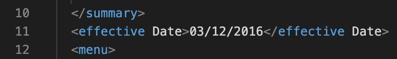
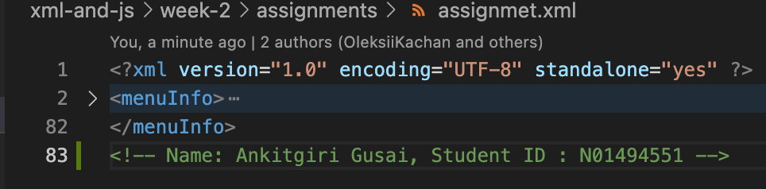
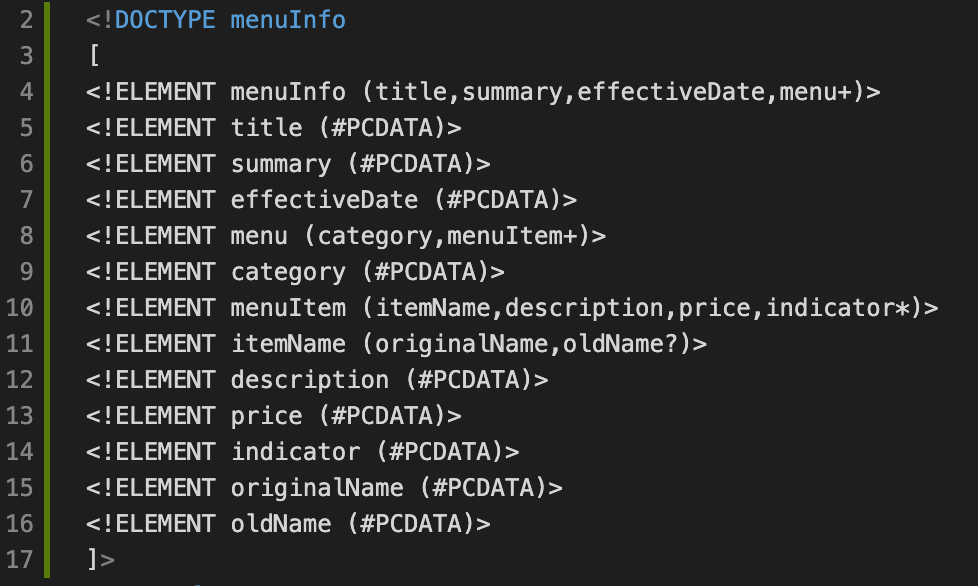
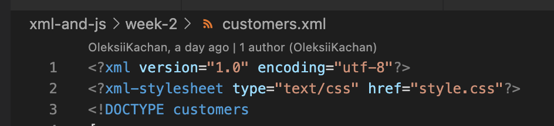
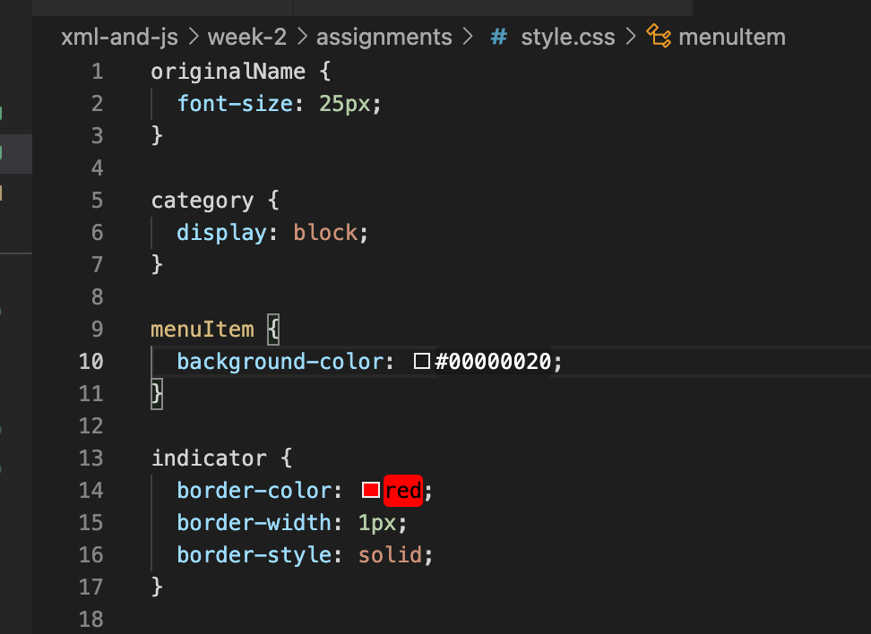

# Evaluation 1

1. **Open `week-2/assignments/assignment.xml` in your browser. Are there any errors? Explain the error and fix it.**
One Error : At line 11, "effective Date" cannot have space in-between.

2. **What is the use of CDATA block in this document?**
    Data under CDATA tag is not proccessed and so it can contain any characters that may not be allowed or needs to be escaped otherwise.

3. **Added comment line to the end of file which contains my name and student id.**
  

4. **Identify prolog, document body, and epilog in the document. Are there any processing instructions?**

    The line number 1 is part of the prolog, content starting from menuInfo tag from line 1 to 82 is the document body and the comment at the line number 83 can be considered epilog. 

5. **Add inline DTD for this document.**

6. **Verify that file is well-formed and valid.**
  Doctument is valid xml and well-formed.

7. **Create `style.css` file and link it to the file. Add the following styles to the .css:**

    - Change font-size of `originalName` - done
    - Display each `category` on the new line - done
    - Add any other css-rule - added background to menuItem tag and border to indicatortag
    
    
    
    
    

