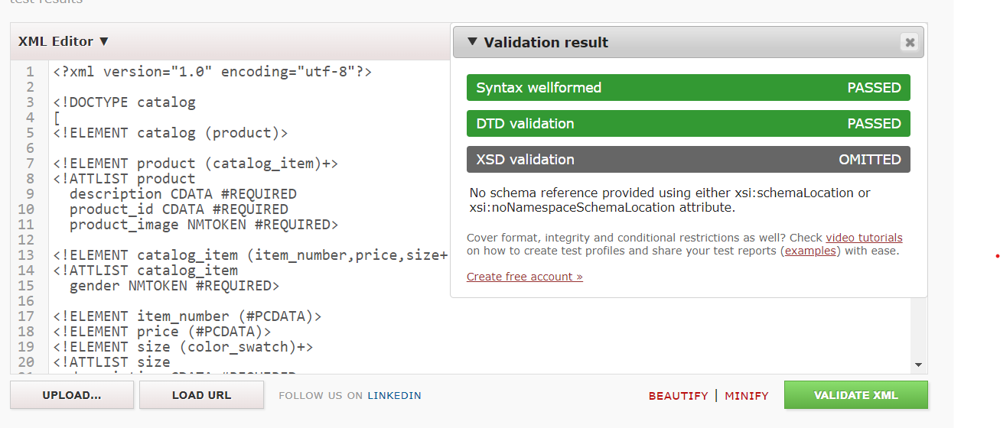
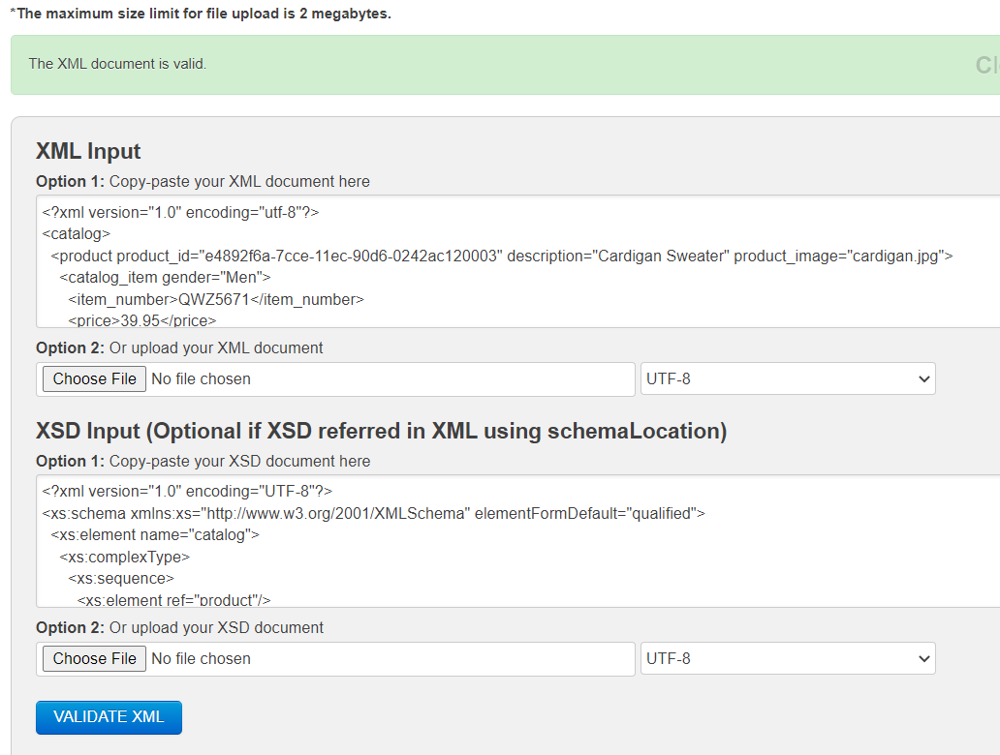

# Assignment

1. **Open `week-3/assignments/assignment.xml` in your editor**
2. Create DTD for this file and validate it using any of the tools we used

3. **Create XSD for this file and validate it using any of the tools we used**

4. **Explain your thought process for these 2 declarations**

DTD format feels more compact so less working but feels errorprone as there no systax highlighting, and it is different than xml. Xsd has same syntax as xml so it is easy to write and it has syntax highlighting which makes code easy to understand.

